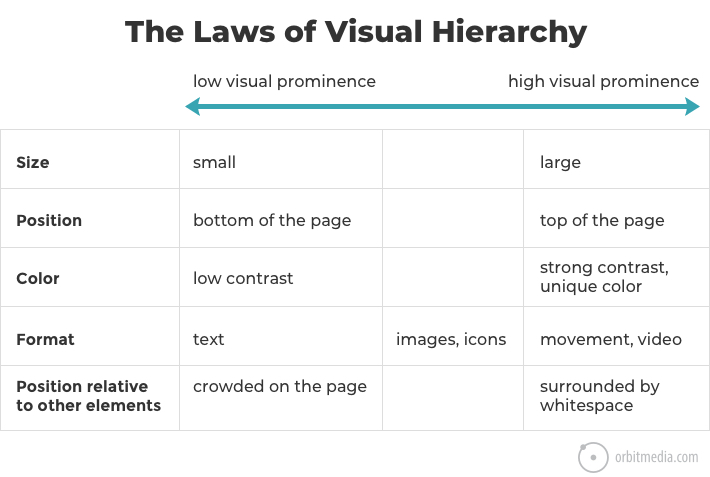
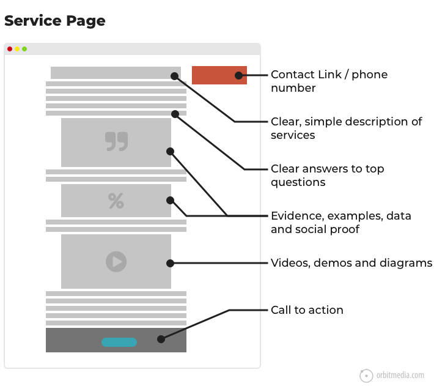

# Design Checklist

## HTML
Map out customer journey through website
Short powerful sections of content
Icons and pictures illustating concepts
Set viewport <meta charset="utf-8" name="viewport" content="width=device-width, initial-scale=1.0">
Imbed fonts for title and body
Use a visual hierarchy

Use a descriptive, keyphrase-focused headline high on the homepage
Long page is better than multiple pages. Scrolling good, clicking bad.
Show one thing at a time, low complexity
Stick to standard layouts
Horizontal navigation in the header
Logo top left
Mobile responsive
Marketing Layout

Use pictures of people with faces, get them to look at something important
Write meaningful subheadings, not generic
No paragraphs longer than 3-4 lines
Avoid jargon, complex words.
Lists have important items at start and end
Answer visitor questions
Add evidence and social proof
Mention scarcity, trigger “loss aversion”
Footer has important links
Call to action button on page for next step
Look at SEO
Use you and your rather than we and our (customer focused)
Check for dead links

## CSS
Set color variables
Set custom colors
Set fonts for title and body (sans serif). No more than 3.
More spacing with padding and line height
Text areas 50-60 characters wide
Use subtle gradients for colors
Subtle shadows to break up areas of content
Small amount of transparency or shadow to break up harshness
Subtle background patterns and texture [Hero Patterns](https://www.heropatterns.com/)
Heroicons?
Font size at least 16px
Everything else relative
Test on iphone and tablet
